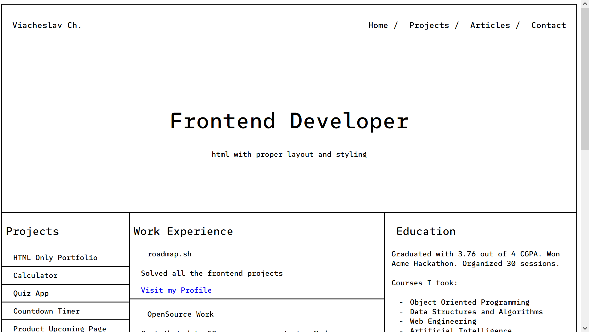

# Basic HTML Website

This is a **Basic HTML Website** project for [roadmap.sh.](https://roadmap.sh/projects/portfolio-website)

## Technologies Used
 - HTML5
 - CSS3
 - Google Fonts (SUSE Mono, Comic Neue)

---

## Key Features
 - Multi-page website with responsive design  
 - Semantic HTML5 structure  
 - Mobile-first approach using `@media (max-width:768px)`  
 - Clean and modern layout with consistent styling  
 - Interactive contact form with validation  

---

## How to Run
 1. Download the **Basic-HTML-Website** folder  
 2. Ensure it contains:
    - `home.html`
    - `projects.html`
    - `articles.html`
    - `contact.html`
    - `style.css`
 3. Open `home.html` in your preferred web browser  

---

## Project Structure
```
Basic-HTML-Website/
│
├── home.html # Main landing page
├── projects.html # Projects listing page
├── articles.html # Blog-style articles page
├── contact.html # Contact form page
└── style.css # Stylesheet for all pages
```

---

## Design Highlights
 - Consistent navigation across all pages  
 - Grid and flexbox layouts for optimal content organization  
 - Fully responsive design that adapts to mobile devices  
 - Professional color scheme and typography  
 - Interactive elements with hover states  
 - Clean border-based design system  

---

## Pages Overview
 - **Home:** Personal profile with projects, work experience, and education  
 - **Projects:** Dedicated projects listing page  
 - **Articles:** Blog-style articles section  
 - **Contact:** Functional contact form with email integration  

---


## Preview



---

Built as part of the [roadmap.sh](https://roadmap.sh/) frontend project challenges
